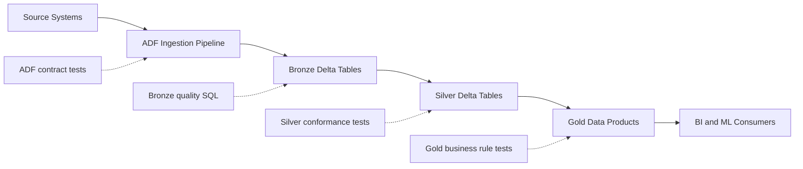

# Enterprise Data Platform Testing Framework (ADF + Databricks Medallion)

This folder provides a simple testing framework for a multi-source
ingestion pipeline built with Azure Data Factory (ADF) and a Databricks
medallion architecture (bronze/silver/gold). The code is intentionally
small and heavily commented for easy understanding.

## What is included

- ADF pipeline contract validation (pipeline JSON + tests)
- Simple medallion rules: not-null and unique checks
- Python tests using the built-in unittest runner
- A Databricks notebook template to run SQL checks in workspace
- A flow diagram (Mermaid)

## Folder layout

```
enterprise_testing_framework/
  adf/
    pipeline_multiple_sources.json
  config/
    sources.json
  diagrams/
    medallion_flow.mmd
  framework/
    __init__.py
    adf_contract.py
    config_loader.py
    medallion_rules.py
    sql_builder.py
  notebooks/
    medallion_quality_notebook.py
  sql/
    bronze_quality.sql
    silver_quality.sql
    gold_quality.sql
  tests/
    test_adf_contract.py
    test_medallion_rules.py
    test_sql_quality_rules.py
```

## Step-by-step workflow

1. **Edit the config**
   - Update `config/sources.json` with your sources and data quality rules.
2. **Update the ADF pipeline JSON**
   - Replace `adf/pipeline_multiple_sources.json` with your exported
     pipeline definition.
3. **Run the tests**
   - From the repository root:
     ```
     python -m unittest discover -s enterprise_testing_framework/tests
     ```
4. **Run data quality checks in Databricks**
   - Use `notebooks/medallion_quality_notebook.py` as a template.
   - Or run the SQL files in `sql/` against Delta tables.

## Flow diagram (ADF + Medallion)



## Code walkthrough (simple)

- `framework/config_loader.py` loads the JSON config that drives tests.
- `framework/adf_contract.py` reads pipeline name, parameters, and activities.
- `framework/medallion_rules.py` builds SQL for not-null and unique rules.
- `framework/sql_builder.py` assembles those SQL checks per layer.
- `tests/` validates the ADF contract and SQL coverage.

## Step-by-step explanation of the code

1. `config/sources.json`
   - Declares sources, expected ADF activities, and simple rules.
2. `adf/pipeline_multiple_sources.json`
   - The pipeline contract that tests validate.
3. `framework/config_loader.py`
   - Loads the config. (Commented for clarity.)
4. `framework/adf_contract.py`
   - Parses pipeline JSON. (Commented for clarity.)
5. `framework/medallion_rules.py`
   - Builds SQL for not-null and unique checks.
6. `framework/sql_builder.py`
   - Assembles SQL scripts per layer.
7. `tests/*.py`
   - Unit tests that confirm the contract and SQL coverage.
8. `sql/*.sql`
   - The actual SQL checks for bronze, silver, and gold.
9. `notebooks/medallion_quality_notebook.py`
   - Runs the SQL checks in Databricks.

## Extending the framework (optional)

- Add new sources to `config/sources.json`.
- Add new layers (for example, "platinum") following the same pattern.
- Add rule types by extending `medallion_rules.py`.
