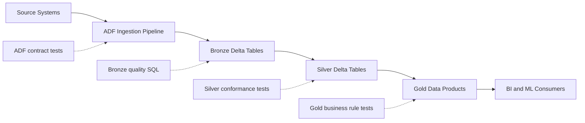

# Enterprise Data Platform Testing Framework (ADF + Databricks Medallion)

This folder provides a lightweight testing framework for a multi-source
ingestion pipeline built with Azure Data Factory (ADF) and a Databricks
medallion architecture (bronze/silver/gold). It is designed to be
straightforward to extend for enterprise data platforms.

## What is included

- ADF pipeline contract validation (pipeline JSON + tests)
- Medallion quality rules (config + SQL checks)
- Python tests using the built-in unittest runner
- A Databricks notebook template to run SQL checks in workspace
- A flow diagram (Mermaid)

## Folder layout

```
enterprise_testing_framework/
  adf/
    pipeline_multiple_sources.json
  config/
    sources.json
  diagrams/
    medallion_flow.mmd
  framework/
    __init__.py
    adf_contract.py
    config_loader.py
    medallion_rules.py
    sql_builder.py
  notebooks/
    medallion_quality_notebook.py
  sql/
    bronze_quality.sql
    silver_quality.sql
    gold_quality.sql
  tests/
    test_adf_contract.py
    test_medallion_rules.py
    test_sql_quality_rules.py
```

## Step-by-step workflow

1. **Define your sources and expectations**
   - Update `config/sources.json` with your sources, expected ADF
     datasets/activities, and medallion quality rules.
2. **Model the ADF pipeline contract**
   - Update `adf/pipeline_multiple_sources.json` with your actual ADF
     pipeline definition (exported JSON).
3. **Run the unit tests locally**
   - From the repository root:
     ```
     python -m unittest discover -s enterprise_testing_framework/tests
     ```
   - These tests validate:
     - Pipeline name and parameters
     - Expected copy activities and datasets
     - Failure handling step exists
     - Medallion rules are complete and consistent
     - SQL checks cover the configured rules
4. **Run data quality checks in Databricks**
   - Use `notebooks/medallion_quality_notebook.py` as a template.
   - Or run the SQL files in `sql/` against Delta tables.
5. **Promote to CI**
   - Add a CI job that runs the unittest command on each PR.
   - Gate deployments on a clean test run.

## Flow diagram (ADF + Medallion)



## Code walkthrough (high level)

- `framework/config_loader.py` loads the JSON config that drives the
  tests and SQL checks.
- `framework/adf_contract.py` parses the pipeline JSON and extracts
  activities, datasets, and failure handling metadata.
- `framework/medallion_rules.py` and `framework/sql_builder.py` build
  simple SQL checks from the configured rules.
- `tests/` validates the ADF contract and ensures the SQL checks
  cover the configured rules.

## Step-by-step explanation of the code

1. `config/sources.json`
   - Declares the sources, expected ADF activities, and the medallion
     quality rules. This is the single source of truth for the tests.
2. `adf/pipeline_multiple_sources.json`
   - Represents the ADF pipeline contract. The tests validate that the
     pipeline contains the expected copy activities, datasets, and
     failure handling step.
3. `framework/config_loader.py`
   - Loads the config and exposes helper functions used by tests.
4. `framework/adf_contract.py`
   - Extracts pipeline name, parameters, activities, and dataset inputs
     so tests can validate the ingestion contract.
5. `framework/sql_builder.py`
   - Translates the configured rules into SQL statements that can run
     directly against Delta tables in Databricks.
6. `tests/test_adf_contract.py`
   - Ensures the pipeline name, parameters, and multi-source activities
     match the expected contract.
7. `tests/test_medallion_rules.py`
   - Verifies the medallion rules are complete and consistent.
8. `tests/test_sql_quality_rules.py`
   - Confirms the SQL files cover all configured rules.
9. `sql/*.sql`
   - The actual queries that enforce not-null, uniqueness, range, and
     referential integrity checks for bronze, silver, and gold layers.
10. `notebooks/medallion_quality_notebook.py`
    - Databricks notebook template that executes the SQL checks and
      displays results per layer.

## Extending the framework

- Add new sources to `config/sources.json`.
- Add new medallion layers (for example, "platinum") by following the
  same pattern in the config and SQL builder.
- Add rule types (regex checks, reference data checks, freshness) by
  extending `medallion_rules.py`.
